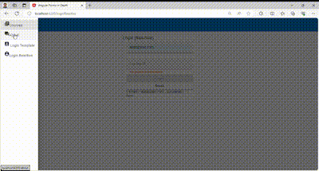

## Angular Forms In Depth

This repository contains the guided practice of the [Angular Forms In Depth](https://angular-university.io/course/angular-forms-course) video course.

This course repository is updated to Angular v17:

  

# To Run the Development Backend Server

An easy back-end server is required. We can start the sample application backend with the following command:

    npm run server

This is a small Node REST API server.

# To run the Development UI Server

To run the frontend part of our code, we will use the Angular CLI:

    npm start 

The application is visible at port 4200: [http://localhost:4200](http://localhost:4200)